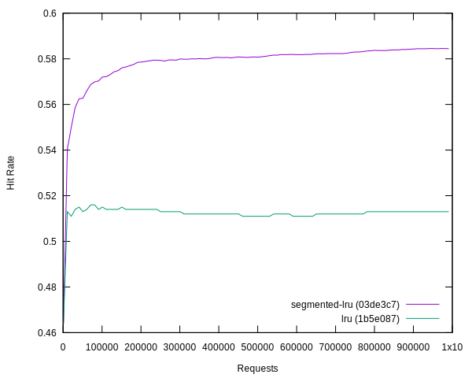
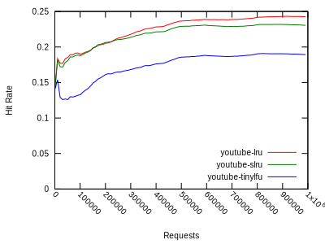
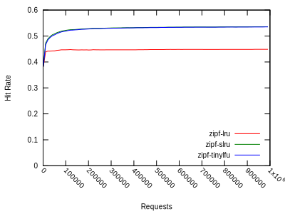

# Cache performance report

```
go test -v -run Wikipedia
./visualize-hitrate.sh wikipedia-*.txt
open out.svg
```

## Wikipedia

Trace files from [WikiBench](http://www.wikibench.eu/)



## YouTube

Trace files from [the University of Massachusetts](http://traces.cs.umass.edu/index.php/Network/Network)



## Zipf


